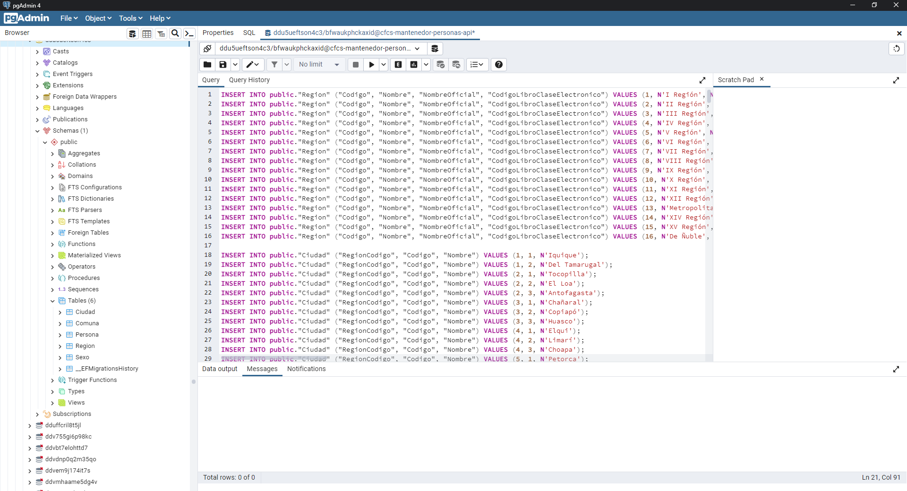

# Mantenedor de Personas - API

Código fuente de una api que expone las funcionalidades de un mantenedor de datos de personas, la cual se construyó utilizando .NET 5, C#, Entity Framework y PostgreSQL

## Instrucciones para levantar el ambiente de desarrollo

### Pre requisitos

* Visual Studio 2019 o superior
* Acceso a una insstancia de PostgreSQL

### Paso a paso

1. Descargar el codigo fuente utilizando el siguiente comando.

   ```
   git clone https://github.com/flakorules/cfcs-mantenedor-personas-api.git
   ```
2. Modificar **ConnectionString -> Mantenedor** en **src\Cfcs.Mantenedor.API\appsettings.json**, reeplazando **"USUARIO"**, **"PASSWORD"**, **"SERVIDOR"**, **"PUERTO"** y **"BASE DE DATOS"** correspondientes a tu instancia de PostgreSQL.

   ```
     "ConnectionString": {
       "Mantenedor": "User ID=<USUARIO>;Password=<PASSWORD>;Host=<SERVIDOR>;Port=<PUERTO>;Database=<BASE DE DATOS>;Pooling=true;SSL Mode=Require;Trust Server Certificate=True;"
     }
   ```
3. Ejecutar el siguiente comando desde directorio **\src\Cfcs.Mantenedor.API**, el cual desplegará en la instancia PostgreSQL la estructura de tablas que soportará el mantenedor. Al igual que en el paso anterior, se deben reemplazar los datos **"USUARIO"**, **"PASSWORD"**, **"SERVIDOR"**, **"PUERTO"** y **"BASE DE DATOS"** correspondientes a tu instancia de PostgreSQL.

   ```
   dotnet ef database update --project Cfcs.Mantenedor.API --connection "User ID=<USUARIO>;Password=<PASSWORD>;Host=<SERVIDOR>;Port=<PUERTO>;Database=<BASE DE DATOS>;Pooling=true;SSL Mode=Require;Trust Server Certificate=True;"
   ```
4. Ejecutar Script "src/INSERT DATA.sql", para ello se sugiere utilizar la aplicación de escritorio PgAdmin, conectandose a la instancia PostgreSQL

   
